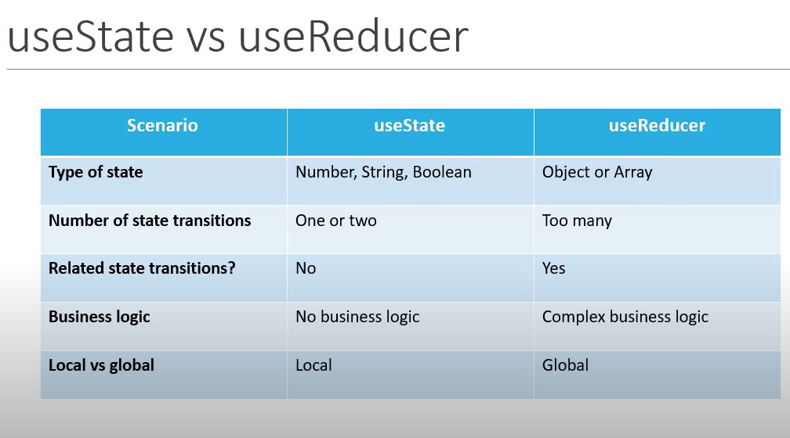

### Exploring useReducer

<ul>
<li>
useReducer() The useReducer(reducer, initialState) hook accept 2 arguments: the reducer function and the initial state. The hook then returns an array of 2 items: the current state and the dispatch function.
</li>

<li>
 const reducer = (state, action)=>{
      
     switch(action){ 
          
         case <i>condition</i>:
          
          return newState;
           
          break;
           
         case <i>condition</i>:
          
          return newState;
           
          break;
           
         case <i>condition</i>:
          
          return newState;
           
          default: 
           
          return state;
           
     }
      
 }
</li>
<li>
const [state, dispatch] = useReducer(reducer, initialState)
</li>
</ul>

<h5>Examples</h5>

<code>
<button onClick={()-> dispatch('actionName')} >Action</button>
</code>

The dispatch function accepts an object that represents the type of action we want to execute when it is called.

 It basically sends the type of action to the reducer function to perform its job, which, of course, is updating the state.

<h3>
<a href="https://www.youtube.com/playlist?list=PLC3y8-rFHvwisvxhZ135pogtX7_Oe3Q3A">Visit Codevolution's React Hook Tutorial Series</a>
</h3>

 